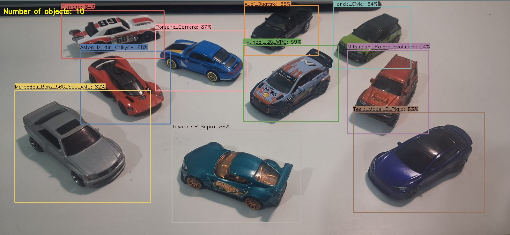

# YOLO Object Detection

Custom-trained YOLO models (v8 & v11) for object detection using the [Ultralytics](https://github.com/ultralytics/ultralytics) framework.

## Sample



## Project Structure

```
yolo-push/
├── yolo_v8/              # YOLOv8 training results
│   ├── my_model_v8.pt    # Trained weights
│   ├── results.png       # Training metrics
│   ├── confusion_matrix.png
│   └── ...               # Curves & batch samples
├── yolo_v11/             # YOLOv11 training results
│   ├── my_model_v11.pt   # Trained weights
│   ├── results.png       # Training metrics
│   ├── confusion_matrix.png
│   └── ...               # Curves & batch samples
├── sample.jpeg           # Sample input image
├── detect.py             # Inference script
├── requirements.txt
└── README.md
```

## Setup

```bash
pip install -r requirements.txt
```

## Usage

Run detection on an image:
```bash
python detect.py --source sample.jpeg
```

Use a specific model version:
```bash
python detect.py --source image.jpg --model yolo_v8
python detect.py --source image.jpg --model yolo_v11
```

Adjust confidence threshold:
```bash
python detect.py --source image.jpg --conf 0.5
```

Save results:
```bash
python detect.py --source image.jpg --save
```

Webcam:
```bash
python detect.py --source 0
```

## Training Results

Both models were trained and evaluated. See the training output directories (`yolo_v8/`, `yolo_v11/`) for:

- **Confusion Matrices** — Classification accuracy per class
- **PR / F1 Curves** — Precision-Recall and F1 score curves
- **Training Batches** — Sample training and validation batches
- **Results Summary** — Overall training metrics

## Built With

- [Ultralytics YOLO](https://github.com/ultralytics/ultralytics)
- Python 3.8+
